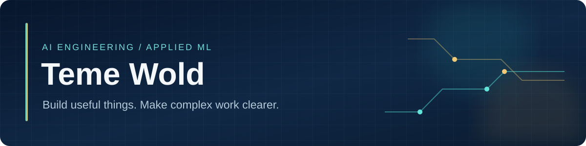

# Teme Wold

I build software and AI tools shaped by hands-on operations work. My path spans entrepreneurship, AI application development, frontline operations leadership, and an M.S. in Software Engineering with an AI concentration from Kennesaw State University.

**Explore:** [AI and data projects](#ai-and-data-projects) · [Public code](#public-code) · [Recent updates](#recent-public-code-updates) · [Creative AI](#creative-ai)

## AI and data projects

| Project | What I built |
| --- | --- |
| **US Field Recruitment Forecasting** · Avis Budget Group | A hiring forecast and review tool with explainable outputs and a Flask interface. |
| **AI Coaching Dashboard Automation** · Avis Budget Group | A role-based prototype that brings performance signals into manager coaching workflows. |
| **Student Performance Pattern Analysis** | A Python and Streamlit ML project with data preparation, model evaluation, clustering, anomaly detection, and visualizations. |
| **Foster Caregiver AI Support** | A chatbot and web app for foster-caregiver FAQs and tailored responses for Angels Among Us Pet Rescue. |
| **Crypto Ranking App and CryptoAPI** | A Flask dashboard and Python API for fetching, ranking, and presenting cryptocurrency data. |
| **MaxFit AI Chatbot** | A fitness question-and-answer chatbot prototype. |

The Avis projects are employer work; their code and data remain private. Earlier application projects are described without public demo links.

## Public code

These are related versions of my personal **RSA performance and coaching** project, built with sample data.

| Repository | Explore |
| --- | --- |
| **[RSA Monitor](https://github.com/teme251/rsa-monitor)** | Scorecards, filters, summary metrics, and individual coaching views. |
| **[RSA Ops Portal v3](https://github.com/teme251/rsa-ops-portal-v3)** | Structured observation and coaching interface. |
| **[RSA Performance Metrics v3](https://github.com/teme251/RSA-PMS-v3)** | Frontline performance reporting view. |

### Recent public code updates

<!-- ACTIVITY:START -->
| Project | Last public update | Commit |
| --- | --- | --- |
| [RSA Monitor](https://github.com/teme251/rsa-monitor) | 2026-09-26 | [`2646b26`](https://github.com/teme251/rsa-monitor/commit/2646b2640a5458e337e408a363d9335bcb745574) |
| [RSA Ops Portal v3](https://github.com/teme251/rsa-ops-portal-v3) | 2026-09-26 | [`da8547f`](https://github.com/teme251/rsa-ops-portal-v3/commit/da8547f9d650fc0bff3695b5f24e3232327d401a) |
| [RSA Performance Metrics v3](https://github.com/teme251/RSA-PMS-v3) | 2026-09-26 | [`f10f13f`](https://github.com/teme251/RSA-PMS-v3/commit/f10f13fffb395771d0f9c7d4cdd686cfb27312fc) |
<!-- ACTIVITY:END -->

This section refreshes weekly from the three public repositories above.

## Creative AI

**QENÉ & CODE** is my AI-assisted music and visual release project: a 13-track album with cover art, lyric visuals, and promotional creative.

## Tools

`Python` · `Flask` · `React` · `JavaScript` · `SQL` · `scikit-learn` · data pipelines · dashboards · AI applications

[LinkedIn](https://www.linkedin.com/in/teme251/) · [Email](mailto:pmtemesgen@icloud.com)
